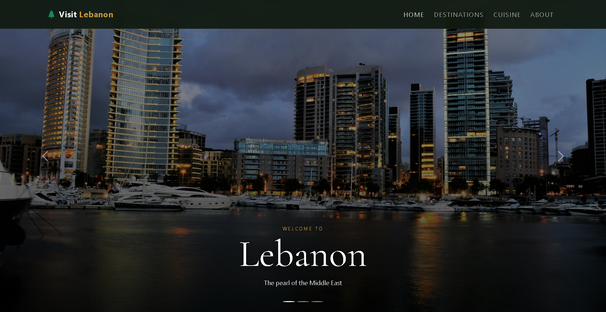
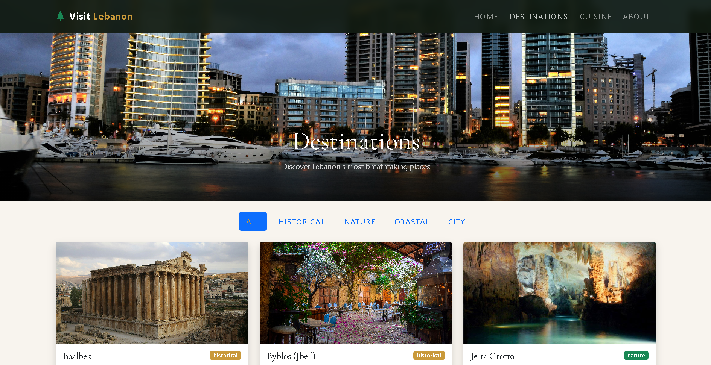
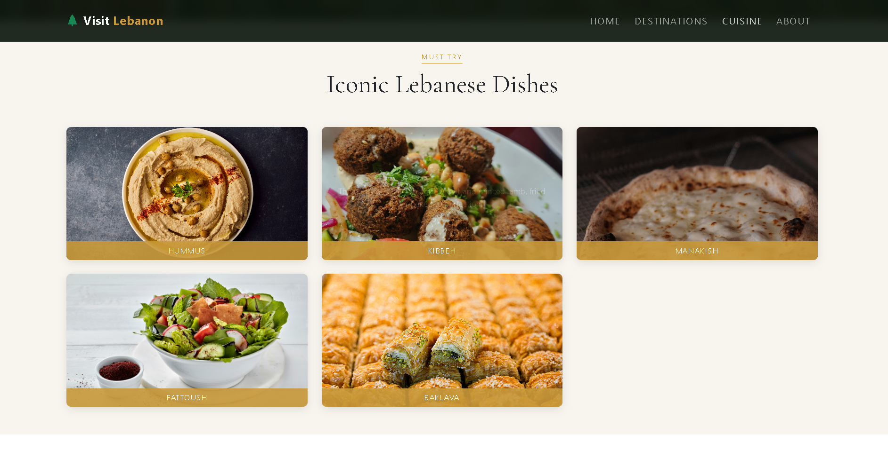
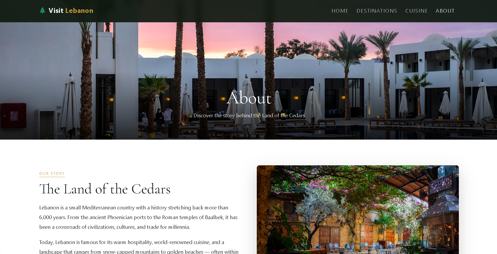

# Visit Lebanon 🌲

A responsive tourism website for Lebanon, built with React. It showcases the country's
top destinations, cuisine, and culture across four pages.

🔗 **Live Demo:** (https://visit-lebanon.vercel.app/)

---

## 📖 Description

Visit Lebanon is a frontend web application that highlights the beauty of the Lebanese country from its culture to its weather. It was built as a CSCI390 project to practice modern frontend development with React.

---

## ✨ Features

- Four pages: Home, Destinations, Cuisine, and About
- Responsive design that works on desktop and mobile
- Animated statistics that count up on load
- Filterable destinations grid (Historical / Nature / Coastal / City)
- Image hover effects on the cuisine gallery
- Expandable accordion for the mezze dining culture section


---

## 🛠️ Technologies Used

- **React** — frontend framework (components, props, hooks)
- **React Router** — page navigation
- **Bootstrap 5** — layout and responsive grid
- **Bootstrap Icons** — icons
- **Google Fonts** — Cormorant Garamond & Jost
- **Custom CSS** — color palette and styling
- Deployed on **Vercel**

---

## 🚀 Setup Instructions

To run this project locally:

```bash
# 1. Clone the repository
git clone https://github.com/khaledkarhani/visit-lebanon.git

# 2. Move into the project folder
cd visit-lebanon

# 3. Install dependencies
npm install

# 4. Start the development server
npm start
```

The app will open at `http://localhost:3000`.

---

## 📸 Screenshots

### Home Page


### Destinations Page


### Cuisine Page


### About Page


---

## 👤 Author

[Khaled Maamoun Karhani]
[CSCI 390 / LIU]

## 🙏 Credits

- Images: [Unsplash]
- Icons: Bootstrap Icons
- Fonts: Google Fonts
- Learning reference: W3Schools